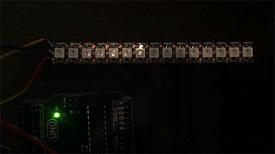

# shiftlight
Arduino powered shift light for automobiles based on rpm.

This started off as a project to add to our FSAE internal combustion engine racecar but was ultimately put on hold.

It supports three separate display modes using three user-defined colors, and it will flash at the set RPM threshold. Currently, the display modes are fully implemented but it is not functional with a real RPM signal yet.

TODO:

* Implement RPM signal
* Make more descriptive README
* Clean up code (?)